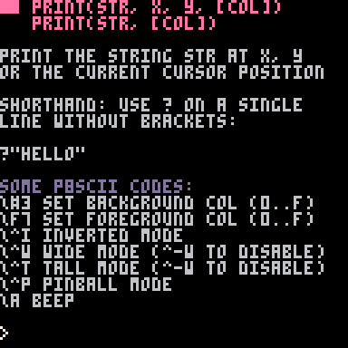

# 1. Getting started with PICO 8

Imagine a hackable video game machine from the 90's, and instead of writing assembly code you have access to a LUA interpreter. Package it as a virtual machine with a bunch of editors (for code, sprite, map, sound effects and music data) and you've got PICO 8.

Most of the workshop we assume you'll be working in the education edition.

> NOTE: If you like to skip this chapter and just run the program at the end you may use the [following link](https://www.pico-8-edu.com/?c=Y2xzKCkKc3ByKDEsNjAsNjAp&g=wG6Aw-w06Cw-wsHQHQaAaAaw-wsXgaAaAaw-wsXg6Ew-wrHQHQqQqw-wy6Cw-w06A).

> ## 1.1 Go to [https://www.pico-8-edu.com/](https://www.pico-8-edu.com/)

The website will show a simple UI with a play button:


> ## 1.2 Click on the play button

When you run PICO8 it initially dumps you out to a faux text terminal.


> ## 1.3 Type `HELP` and hit enter

Do note that PICO-8 only types in upper-case letters. If you try to type with Shift-key held in, you'll get a bunch of characters instead.


The "help" will list some commands and things you can do. You can also anytime type in `help` together with an API to get info about that keyword.

> ## 1.4 Type `HELP PRINT` and hit enter



This will show the help entry for the `PRINT` command. You can issue it on the console like this:

> ## 1.5 Enter the [following commands](https://www.lexaloffle.com/dl/docs/pico-8_manual.html#_Hello_World):
>
> - `PRINT("HELLO WORLD")`
> - `RECTFILL(80,80,120,100,12)`
> - `CIRCFILL(70,90,20,14)`
> - `FOR I=1,4 DO PRINT(I) END`

It'll look something like this:


Congratulations, by issuing these commands you wrote some lua code.

> ## 1.6 Hit ESC key to toggle the code editor


What you see is PICO-8's editor mode, currently on the [code editor](https://www.lexaloffle.com/dl/docs/pico-8_manual.html#Code_Editor), it is currently empty. You can hit ESC to toggle between the console and the editor. There are 5 editors you may use, and they're accessible by clicking on the icon bar on the top right.


From left to right, they are: Code editor, Sprite editor, Map data editor, Sound effect editor, Music editor.

To get started lets draw a sprite and write a program that just that sprite with the `SPR` function.

> ## 1.7 Open sprite editor by clicking on the second tool icon at the top right
>
> - Select the second sprite (001)
> - Select a color from the palette
> - Draw something

Something like this:


The sprite editor lets you draw 8x8 pixel drawings. These can be used in code with the `SPR` and `SSPR` functions.

> ## 1.8 Go back to code editor by clicking on the first tool icon at the top right
>
> Type in the code below:

```lua
CLS()
SPR(1,60,60)
```

Why are the X and Y arguments 60? This is to draw the sprite in the middle of the screen. PICO-8 screen is 128x128 pixels. Halfways is 64x64. Sprite is 8x8 pixels and needs to be nudged halfways up and right (4x4) to be centered.

NOTE: If you'd like to know about short-cut commands and more, read the [manual entry 2.1 Code Editor](https://www.lexaloffle.com/dl/docs/pico-8_manual.html#Code_Editor).

You'll notice that some of the code "costs" so called tokens. You can see the token count at the bottom right in the code editor, a PICO-8 program can max only have 8192 tokens. It is enough to write small games in and once you've internalized [how token count works](https://www.lexaloffle.com/dl/docs/pico-8_manual.html#Code_Limits), you'll find [ways to reduce tokens](https://github.com/seleb/PICO-8-Token-Optimizations). But for now, you'll most likely won't hit the token cap. Left click on the token count to also list char count limit and compression capacity. You can also output all that information on the console with the `INFO` command.

> ## 1.9 Run the program
>
> Either with:
>
> - CTRL-R in the editor
> - Issue RUN command in the console

You should end up with the following output:


Congratulations, you've now written and ran your first program for PICO-8.

> ## 1.10 Save the program
>
> In the console issue `SAVE MYGAME`

The game will be saved as a PICO-8 cartridge file, "mygame.p8". In the _education edition_ this will now be in a virtual storage, i.e. the local browser storage (IndexedDB to be precise). If you're using the PICO-8 app it will be stored in your filesystem. PICO-8 provides the `FOLDER` command that will open the cartridge folder.

Saving the program will also download the p8 file. You can share this file with others who can drag and drop the p8 file on the PICO-8 app to load it.

You can also share the URL to the _education edition_ with `SAVE @URL` command. One you hit enter the browser's address bar will change and may be copied.

## Points to review

- Issue `HELP` to get help, together with a command e.g. `HELP PRINT` to get help entry for that command.
- `CLS` for clearing the screen
- `PRINT` for drawing text on the screen
- `RECTFILL` and `CIRCFILL` to draw a filled rectangle and filled circle respectively
- Press escape key (<kbd>Esc</kbd>) to toggle between the editor and the terminal
- There are five editors: Code, Sprite, Map Data, SFX and Music editors. ([Manual Reference](https://www.lexaloffle.com/dl/docs/pico-8_manual.html#Editing_Tools))
- Draw sprites with `SPR` and `SSPR`
- Hit `CTRL-R` or issue `RUN` command in the console to run the currently loaded cartridge
- `SAVE MYGAME` to save the program as the cartridge file "mygame.p8", `SAVE @URL` to share the program in education version.
- (Not in Education version) `FOLDER` to open the cartridge folder in your system's file explorer
- You can drag and drop the `.p8` file on the PICO-8 app to load it.

## [Next Chapter - Your First loop](./2-your-first-loop.md)

## [Back to the README](./README.md)
