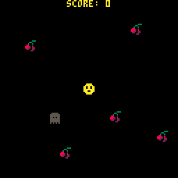
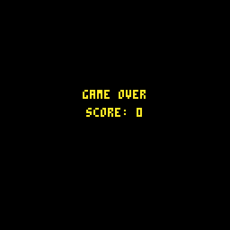
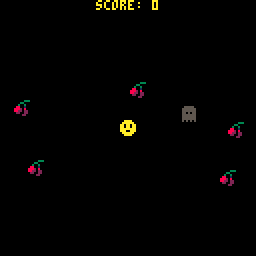
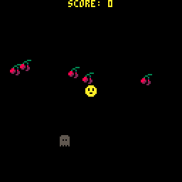

# 10. It's Game Over, Man!

> To skip this chapter use the [following link](https://www.pico-8-edu.com/?c=AHB4YQwaBIQCwKzObYwu7c0N5CvNLY0OJUUBBC5Mji5tjK1srmevTwHkLKyt7M2uTO6LrgdGAQSOLSyvTK5nTwEEBA-gmjtO2PfBS-jw6pfIfNb48BGufolIXfSEZzj9BY6-wx0H3N8kXjmm7_IkeocHqB4hGmiqh2iqqko6-_TvkA3cNCMRNGOzGd0Qd4iNxF3Z57Ws_PsCSR4PrWgKOUZmML5pKFqZMozAoFLghFL4c5NS_HuVpvixoSl_n6UU-miKuwyGnmGjVjnYCEaqw4qZtSybG8uyaKyZS5QWpnXLsZO39dJAP2fHoJgyP0bMz8CcUSCQKKxST2RRM5iuDSozZHGnLCxz4KMitHRi2UCi8A1mdgZmRESVwyFJNCfOOrZ13EQhSo7U-QrcH8mDrfQdNkYGmmYxShTfqrWBcKZ7hXBzdCmIs1D2PLfJNQz4HQN_KgMJuL1CkWJoa2AwGJCnTKs4qpRpFpsm7BaX5q7TGVCnmFkKHkEoaEHSRluqHin2ZEPt4xd3RaoSqbJcsSTCVHT5ViVg48exwPGsFHFsJR1e40nZzAjrQ7ROaXRz0v9WynHPzNyQTfxQioQf0uOU6UpXBsa68jDTDJmm2NlZTJYS60cc6cIsWw6clC37T56c6uXWS1HTW003uiOLVFEXEILl0Q8F9UvNR8H8jiK1tioaGEjmVoIOOII77bYuV0SV7GKOME8LvSi76YcKwsoHmk9DnOowa3qjQpBqg4HaeLXTb_n0-xA1-08ZeChZlYPKhigUjqHUNcQVni3xZddLhGF6RBBXq8UQzYBueESDVetPufbHuIJiPBYmvk4Je8iv-5d2xFq4tdTLtq1oNQ4cOS1lHA5otsPfxhHzqvPcKwI_wtCle-JkpvWRrt-QtNu36b1Zz-TiqEKrx0nEDsyp2QJC_CUS-1fEHwrn7qM4KtTNIeqefGJwuRMzv7fFDDUga7ev9t7CgpqpZpJu5ULbCZwfCnB7RddiTZjKuQylpqv9TxF0ukGXPYwf1kYrI2ncDpB_mNvF9_FrAT8cAB-SAHz4SW8BCvpWitqrt7U_BpdHq4ZVw0aSpYndUOAhilZ8EAxqUtZzDzGzs8KIAaweQIYBM6Egv8U7X6Id2IiKiY1IVjhO242kcoF34CnUK93s4ki-Z4_J9WJoSTVUJf2RosdYOiUuDJ2hicafhNmIaFokMkc34ZBU01QQrhsZKHwkU1B4wFMMJYDFAW0Upc3YpPTKYhUYL9QIWDH_NZLO_WwlsV0Y_irbfIrFTENsQ0JwaYFpA2V1baXs19jM2s54DcX4U0B8C8vUGlJma8MNxoUockSbGx4QH7GClDJrhls-fEmyIfklH7DQRlgipCJgpUq8SyBgatglI9q9kxPQGJ6xqtO2-yN9rYwPegrakJvVaof4jcC29p00jBzj4LACpmeUGD2pqw7lLUoVj81sp32tpE5vbej5yOYc0IUDex7IZdNfsXBo5fb0ELooHGDrxLaBLQLbDjXFRjGYxwpbc_FcW80JPIiuSM6Zpa1kJmV6AA==&g=wG6AwDjA1Bw-wk6CwATg1Dw-wcHQHQaAaAaQDQDQ1Dw-wdXgaAaAaAYQBQVAFAVw-wdXg6EoCAIQ1Dw-wcHQHQqQqYSASA1Dw-wj6CQSQSA1Dw-wk6AwCSQFAFAFAF)

## I ain't afraid of no ghost!

Okay, next up we need to get the ghosts kill the player and show a game over screen when the player is killed.

So first, killing the player, lets do the same collision check as with the cherries. When player hits a enemy, set a flag on the player that the player is dead and spawn some yellow particles in place. Lets also unspawn the enemy so it doesn't continue spamming particles:

```lua
FUNCTION _UPDATE()
 -- SNIP SNIP
FOR E IN ALL(ENEMIES) DO
 E:UPDATE()
 IF DIST(PLAYER.E) < 4 THEN
  PLAYER.DEAD=TRUE
  ADD_PARTICLES(
    20,
    PLAYER.X,
    PLAYER.Y,
    10 -- YELLOW
  )
  DEL(ENEMIES,E)
 END
 -- SNIP SNIP
END
```

Now when the player is dead, lets make it so that the player doesn't draw and spawn some yellow particles in place. Lets do that in the player's `DRAW` function:

```lua
PLAYER={
 -- SNIP SNIP
 DRAW=FUNCTION (SELF)
  IF SELF.DEAD THEN RETURN END
  SPR(1,SELF.X,SELF.Y)
 END
 --SNIP SNIP
}
```

When running the game it'll look something like this:



## Lets add a game over screen

The ghosts are still going at it though, so we'll need to pause the updates for a little while and show a game over screen.

So first of all we need to move the particle update to the top of `_UPDATE` and then exit the function if the player is dead so the rest doesn't update:

```lua
FUNCTION _UPDATE()
  -- MOVE PARTICLE UPDATE TO THE TOP OF THE FUNCTION
  FOR P IN ALL(PARTICLES) DO
   P:UPDATE()
  END
  IF PLAYER.DEAD THEN
   RETURN
  END
END
```

LUA like most dynamic languages lets you set functions in variables. So lets create a couple of variables that determines what will be drawn and updated, e.g. `_UPD` and `_DRW`, and extract all the code from the `_UPDATE` and `_DRAW` functions. The easiest way is to:

1. Rename `_UPDATE` to `UPDATE_GAME`
2. Rename `_DRAW` to `DRAW_GAME`
3. Set variables `_UPD` and `_DRW` in `_INIT` to point to the renamed functions.
4. Create new `_UPDATE` and `_DRAW` function that calls `_UPD` and `_DRW` respectively.

It should end up like this:

```lua
FUNCTION _INIT()
 -- SNIP SNIP
 _UPD=UPDATE_GAME
 _DRW=DRAW_GAME
END

FUNCTION _UPDATE()
 _UPD()
END

FUNCTION _DRAW()
 CLS()
 _DRW()
END

FUNCTION UPDATE_GAME() -- PREVIOUSLY _UPDATE
 -- SNIP SNIP
END

FUNCTION DRAW_GAME()
 -- SNIP SNIP
END
```

## Lets make the Game Over screen

To make a game over screen we need to make a separate function for drawing and updating the game over screen. For the draw function lets draw the score and GAME OVER in the middle of the screen:

```lua
FUNCTION DRAW_GAME_OVER()
 PRINTC("GAME OVER",50,10)
 PRINTC("SCORE: "..SCORE,60,10)
END
```

You can try it out by setting that as function for `_DRW` in `_INIT`. It should look like this:



We want to restart the game from the game over screen, so lets do that with a button press. We can check this with the `BTNP` function.

```lua
FUNCTION UPDATE_GAME_OVER()
 IF BTNP() > 0 THEN
  _INIT()
  _DRW=DRAW_GAME   -- JUST IN CASE YOU'VE CHANGED
  _UPD=UPDATE_GAME -- THESE IN _INIT FOR TESTING
 END
END
```

Lets now make sure the game over screen is shown when the player has died:

```lua
-- IN UPDATE_GAME
IF PLAYER.DEAD THEN
 _DRW=DRAW_GAME_OVER
 _UPD=UPDATE_GAME
 RETURN
END
```

When you run the program it should look like this:



The ending is a bit abrupt and you hardly see the particles happening as the player dies. Lets fix that...

## Make the ending less abrupt

We also want to pause for a second before revealing the game over screen. So add a variable for game over timer `GAMEOVER_T` in the `_INIT` function so we have something to start with.

```lua
FUNCTION _INIT()
 GAMEOVER_T=0
 -- SNIP SNIP
END
```

Lets set it in with a second or so after game time with `T` and when that time is reached, switch the screen:

```lua
-- IN GAME_UPDATE()
IF PLAYER.DEAD THEN
 IF GAMEOVER_T==0 THEN
  GAMEOVER_T=T()+1
 END
 IF T()>GAMEOVER_T THEN
  _DRW=DRAW_GAME_OVER
  _UPD=UPDATE_GAME_OVER
 END
 RETURN
END
```

When running the game and trying to die again, the game should wait a bit before switching to the game over screen!



## Points to review

- Good idea: Extract update and drawing code to own functions and set them dynamically during run time to switch screens or "scenes".

## [Next Chapter - What to do next](./11-what-to-do-next.md)
