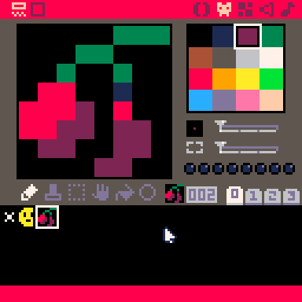
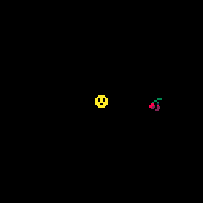
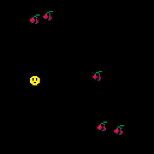

# 5. Pick Me Up

> To skip this chapter use the [following link](https://www.pico-8-edu.com/?c=AHB4YQOQAaEPcP3NL3H4G9z0FhPDTxHdc8odWZba7PYwtFFjszR_iuj6l3iF_1-iDd4huuYlZnbSe0ZGgmxporxqxy1H7dhsxxZ5PyQjsNImQyuZZvizsrHwBlU6MLWSVa_QdoaInLNQL5y11VZrfpAPkAnHjEz4cZZM_HeYmrh31MTPy2TCDzVxlkH8EDu1rMFA0Fe3FUtLWbY3l2XRXDOWtHG1p1W808T52MDAnh2DYs3bI95n4L0oEERUPek3sqiZTOfmRBayuJMVlTbwURE6NnFsIE42ubMxMKMgKhssRjQnwzq2dd5EIUecml_B_aF0sJVubowMNM1ilAgxFGNjXbFQ7oTPEG6OTgV1Fqqd4zhlhgU7L9ipDISeBl_jCKbWFjaChaRd3DWDRmz6DFlfLGyqRIxuxGGWrk0eKDagGTG1FuSKQTPmEXvxiG54pGasMzK2YRN9uhtdqyYiH1bXG0maBRPyo6v6YubTCxYYv5TptMVjaCVyKpXTDVLDeSWXoZex0OXZwOJkWbphwO3Ty18qmK2YVSnmH5p3WwJE&g=wG6AwDjw-wq6CwATw-wmHQHQaAaAaQDQDw-wmXgaAaAaAYQBw-wmXg6EoCAIw-wlHQHQqQqYSASw-wr6CQSQSw-ws6AwCS)

## Add some other stuff

Now that we know how to create objects, lets create more of them. First draw something that the player can pick up, like a couple of cherries. Go to the sprite editor and draw one in the next empty sprite tile.



Lets try to add that cherry into the scene by adding a table for the cherry and drawing it in `_DRAW`. We may randomize it's position with [PICO-8's `RND(X)` function](https://pico-8.fandom.com/wiki/Rnd) that will return a random value between 0 and X. 120 is appropriate because it be placed outside or on the bottom and right edges.

```lua
CHERRY={
 X=RND(120),
 Y=RND(120),
 DRAW=FUNCTION(SELF)
  SPR(2,SELF.X,SELF.Y)
 END
}

FUNCTION _DRAW()
 CLS()
 PLAYER:DRAW()
 CHERRY:DRAW()
END
```

When running the program with <kbd>CTRL</kbd>+<kbd>R</kbd> it should show the cherry in a random position.



## More cherries for the people!

One cherry is fine and dandy, but what about adding more? Now we don't want to track more cherries with `CHERRY2` and `CHERRY3`... that will get verbose quickly. We can use arrays instead and good thing LUA tables can be used as arrays as well! Create a table called `CHERRIES` and add new elements with [PICO-8's `ADD` function](https://pico-8.fandom.com/wiki/Add).

So lets create a "factory function" that will create new cherries and add a table for all the cherries:

```lua
CHERRIES={} -- THIS TABLE WILL BE USED AS A LIST OF CHERRIES

FUNCTION ADD_CHERRY()
 ADD(CHERRIES, { -- ADDS THIS OBJECT TO THE CHERRIES TABLE
  X=RND(120),
  Y=RND(120),
  DRAW=FUNCTION (SELF)
   SPR(2,SELF.X,SELF.Y)
  END
 })
END
```

To initiate you'll need to call `ADD_CHERRY` several times, but you can only do it after the function was defined (as LUA executes the code as it evaluates it). To avoid this, lets use `_INIT()` function that will be called once LUA parser has gone through all the code, and put the initialization there.

Now we don't want to repeat ourselves (remember DRY?) so lets do a `FOR`-loop:

```lua
FUNCTION _INIT()
 FOR 1,5 DO
  ADD_CHERRY() -- is called 5 times
 END
END
```

To draw the cherries we need to go over the array and call their drawing functions. There are two ways to do this, the simpler is to use indices in a `FOR` loop. Do keep in mind that LUA tables have their first element in index 1. Yes, LUA tables are not zero-based arrays!

To get the length of an array table, you prefix the variable with `#`. In the case for the cherries you write `#CHERRIES` to get the length. And now you can iterate over all cherries with a FOR loop between `1` and `#CHERRIES`.

All in all you'll get the following `_DRAW` function.

```lua
FUNCTION _DRAW()
 CLS()
 PLAYER:DRAW()
 FOR I=1,#CHERRIES DO
  CHERRIES[I]:DRAW()
 END
END
```

Try it out with <kbd>CTRL</kbd>+<kbd>R</kbd> to see all the cherries in the scene being drawn.



An _alternative way_ of going over a table is to use LUA iterators. PICO-8's API provides a couple `ALL` and `PAIRS`. The syntax is as follows if you only want to draw all cherries:

```lua
FOR CHERRY IN ALL(CHERRIES) DO
 CHERRY:DRAW()
END
```

## Points to review

- `RND` gives you random values
- Tables can also be used as array/lists
- `ADD` adds elements to a table
- Keep in mind that if you want to go over an array with `FOR` loop that the first index is at `1`.
- You can also use LUA iterators to go over a table `ALL` or `PAIRS`. The latter will give entries in a `KEY,VALUE` pairs.

## [Next Chapter - Crash Test Dummies](./6-crash-test-dummies.md)
