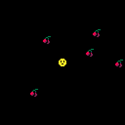

# 6. Crash test dummies

> To skip this chapter use the [following link](https://www.pico-8-edu.com/?c=AHB4YQREAe0PcP3NL3H4G9z0FhPDTxHdc8odWZba7PYwtFFjszR_iuj6l3iF_1-iDd4huuYlZnbSe0ZGgmxporxqxy1H7dhsxxZ5PyQjsNImQyuZZvizsrHwBlU6MLWSVa_QdoaInLNQL5y11VZrfpAPkAnHjEz4cZZM_HeYmrh31MTPy2TCDzVxlkH8EDu1rMFA0Fe3FUtLWbY3l2XRXDOWtHG1p1W808T52MDAnh2DYs3bI95n4L0oEERUPek3sqiZTOfmRBayuJMVlTbwURE6NnFsIE42ubMxMKMgKhssRjQnwzq2dd5EIUecml_B_aF0sJVubowMNM1ilAgxFGNjXbFQ7oTPEG6OTgV1Fqqd4zhlhgU7L9ipDISeBl_jCKbWFjaChaRd3DWDRmz6DFlfLGyqRIxuxGGWrk0eKDagGTG1FuSKQTPmEXvxiG54pGasMzK2YRN9uhtdqyYiH1bXG0maBRPyo6v6YubTCxYYv5TptMVjeKiL-5d6RdyVI5VqXi9FmF25q2YdDkmSw9_ytnLnjxw63SAeHk0OUY6VvAlHNkfT1g0jbp8o-yZUuWW5Kln_Q1hvrdJbr5zRRrao5zEytVM1mnRTyfbwbKjqEUW5DzQqRlaGRpudjamniLIhSQghDiWIpVROCA==&g=wG6AwDjw-wq6CwATw-wmHQHQaAaAaQDQDw-wmXgaAaAaAYQBw-wmXg6EoCAIw-wlHQHQqQqYSASw-wr6CQSQSw-ws6AwCS)

## So when are we gonna pick up the cherries?

We want our player token pick up all the cherry tokens it reaches. For this we need to implement a collision check. Unfortunately PICO-8 API doesn't provide one, so you'll need to make one yourself.

The easiest way to do a collision check is to check if both the player token and any cherry is close enough. We can check the distance between points, such as the center of player and cherry and see if it is less than 4 pixels or so.

A distance function, if you don't remember math, is given from pythagorean function. You may create a function that takes two tables (that presumably have X and Y) and calculate the distance. We need to define some variables, and to not pollute the global scope you can use `LOCAL` to define variables to be bound by the function scope it is in:

```LUA
FUNCTION DIST(A,B)
 LOCAL DX,DY=A.X-B.X,A.Y-B.Y
 RETURN SQRT(DX*DX+DY*DY)
END
```

Now lets use that in our `_UPDATE` function and check the distances with with our `DIST` function between all cherries and the player. `IF` they are close enough `THEN` remove the cherry with [PICO-8's `DEL` function](https://pico-8.fandom.com/wiki/Del).

```LUA
FUNCTION _UPDATE()
 PLAYER:UPDATE()
 FOR CHERRY IN ALL(CHERRIES) DO
  IF DIST(PLAYER, CHERRY)<4 THEN
   DEL(CHERRIES, CHERRY)
  END
 END
END
```

Do note that as with `FOR` loops, `IF`-statements in LUA doesn't need parenthesis for it's arguments.

Running <kbd>CTRL</kbd>+<kbd>R</kbd> you'll be able to pick up the cherries in the stage now.



## Points to review

- `IF-THEN-END` statements for decisions, like in other languages No need for parenthesis to enclose the expression
- `DEL` removes/deletes the given object from the given table

## [Next Chapter - Keeping the Score](./7-keeping-the-score.md)
