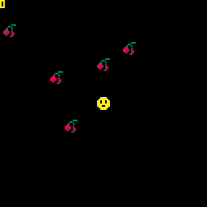
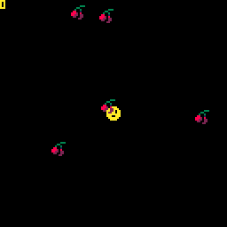
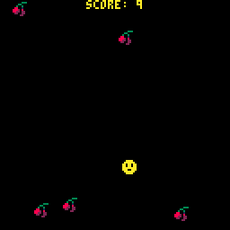

# 7. Keeping the Score

> To skip this chapter use the [following link](https://www.pico-8-edu.com/?c=AHB4YQT3AkMPcP3NL3H4G9z0FhPDTxHdc8odWZba7PYwtFFjszR_iuj6l3iF_1-iDd4huuYlZnbSe0ZGgmxporxqxy1H7dhsxxZ5PyQjsNImQyuZZvizsrHwBlU6MLWSVa_QdoaInLNQL5y11VZrfpAPkAnHjEz4cZZM_HeYmrh31MTPy2TCDzVxlkH8EDu1rMFA0Fe3FUtLWbY3l2XRXDOWtHG1p1W808T52MDAnh2DYs3bI95n4L0oEERUPek3sqiZTOfmRBayuJMVlTbwURE6NnFsIE42ubMxMKMgKhssRjQnwzq2dd5EIUecml_B_aF0sJVubowMNM1ilAgxFGNjXbFQ7oTPEG6OTgV1Fqqd4zhlhgU7L9ipDISeBl_jCKbWFjaChaRd3DWDRmz6DFlfLGyqRITxRBzHa3092nVN3M1NHqg6IB6xNRdsSAftTIjG5R4REI-mjHUW1jZsIlR3o2vVROTD_n4mibOg1CFd1Rczn16wrNTmRhgOxd1tmkRxnGwHThpZKmaSXH-cCnbS4zE8xMf-S_VipZ6oY3W9UKkwu3JZ9TocUyyHv42jl7S9VUvhmkg14zqd1W5MOldC-X8k1ukGxfEIfih_zMyUdbc8kfduGHP7FP83I-mt_VVp-h_qfZMa6tZAGqtmhT-WBteqRvBuJNnang61KqKo9oEAxsjS1nCzM7H2FFE2pDeh8iEzsZRKslu_8S3qiZWoGFmJZIXjtF1JKhd4Z0jn0Svh-uDOwJ49NraLsVI1VO0D&g=wG6AwDjw-wq6CwATw-wmHQHQaAaAaQDQDw-wmXgaAaAaAYQBw-wmXg6EoCAIw-wlHQHQqQqYSASw-wr6CQSQSw-ws6AwCS)

## How many cherries did I pick up?

Lets add a global variable for the state telling how many cherries the player has picked up. So lets initiate a `SCORE` variable in `_INIT` and start with zero.

```lua
FUNCTION _INIT()
 SCORE=0
 FOR I=1,5 DO
  ADD_CHERRY()
 END
END
```

Increasing the score can be done when the game removes the cherry in the `_UPDATE`. You can increase it with `I=I+1`, but you may also use the shorthand `+=` in PICO-8 (which isn't part of standard LUA).

```lua
FUNCTION _UPDATE()
 PLAYER:UPDATE()
 FOR CHERRY IN ALL(CHERRIES) DO
  IF DIST(PLAYER, CHERRY)<4 THEN
   DEL(CHERRIES, CHERRY)
   SCORE+=1
  END
 END
END
```

The last piece of the puzzle is to draw the score on the screen. Which we will do with `PRINT` again. So in our `_DRAW` function lets do this and use color 10 (yellow):

```lua
PRINT(SCORE,0,0,10)
```

Run the game with <kbd>CTRL</kbd>+<kbd>R</kbd> and it should look like this with the score printed out in the top left corner:



## Respawn those cherries

After you've picked up all five cherries, there are no more to pick up! Lets add more cherries as you pick them up. In the `_UPDATE` function after updating all the cherries, add a cherry if there are less than five cherries available.

```lua
FUNCTION _UPDATE()
  -- SNIP SNIP
  IF #CHERRY < 5 THEN
   ADD_CHERRY()
  END
END
```

When running the game it should look like this:



Feel free to remove the initialization of five cherries in the `_INIT` function.

## Center the score!

In order to keep the score centered we need to know the width of the string. It will change once you've picked the tenth cherry and the 100th cherry. Thankfully we do know that the font is 4 pixels wide (including the 1 pixel space between characters).

We also need to know is how many characters the number has. This can be done by coercing the number to a string (w. PICO-8's `TOSTR` function or concatenating the number with a string) and get the length of that string.

Middle of the screen is at 64 pixels (i.e. half of 128 pixels). We can print the string with an offset away from 64 pixels based on the information above. Lets write a function that prints the text in the center:

```lua
FUNCTION PRINTC(VAL,Y,COL)
 LOCAL STR=TOSTR(VAL)
 PRINT(VAL,64-(#STR * 2),Y,COL)
END
```

Lets use that function to print the score, and concatenate a label to the number. E.g. `SCORE: ` like this:

```lua
FUNCTION _DRAW()
 -- SNIP SNIP
 PRINTC("SCORE: "..SCORE,0,10)
END
```

Running the game should look like this, and the score should center together with the label:



## Points to review

- There are [shorthands in PICO-8](https://www.lexaloffle.com/dl/docs/pico-8_manual.html#PICO_8_Shorthand) that don't exist in LUA. E.g. `+=`, `-=` etc.
- Get the string from anything with `TOSTR`
- Concatenate strings with `..`, also coerces number to a string

## [Next Chapter - Particle Galore!](./8-particle-galore.md)

## [Back to the README](./README.md)
