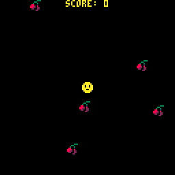

# 8. Particles Galore

> To skip this chapter use the [following link](https://www.pico-8-edu.com/?c=AHB4YQd4AyQCwKzObYwu7c0N5CvNLY0OJUUBBC5Mji5tjK1srmcP4DXccP3NT3H4I9z0GBPDwVtE95xyhw9SH96eZT5rfJjGbxHpiZ7xEP3A_Ze4Y6B6hzY8aMAu9wzYbMA39TNMiIk8RZtsPEUmG369wsTCE1TpwM5IVr1C2jkm8s5CvXDVUFtNGUZCQCk8M0rhz1VK4e9dmuLHjqb4fZhS_KMp7jKIH2KnVjkYCPrqtGJpKcvm5rIsmmvGkjauBnXLsdPE_djAwJ4dg2LN-BgxPwNzRoFAoghKv5FFzWA6N6e8kMWdsrDMgY_K0NKJZQOJwlfY2RiYERFVDock0Zw469jWeROFKDlS9ytwfyQPttKX2BgZaJrFKFFnKMbGumKh3AnfIdwcnQrqLJQ9z3VyDQt_x4KfykACbrDQmFgaG5gIBgQn0yqOqsGlNF3suibtpubu0xlQn9iZCp5BKGhCpEb6xSO1fj3kZ6wzMDVhE-mQuTzfSdos2NS0nhQT625UC9WQErnztPKI1Jh_qEKpfKD5NMS7UZZbcXibflEXJ8uBk0aWipkk1yq36l1YSA8bHuLj-yWMsVJP1JUyX6hUmF25K5QdjimWw9-G0VZa3qq9oqci9V26ZyDJWx-JrPXDbt_U9wY9o9_5ZTKljuskXAfm5Hr12h9J9v8RRYe6_6P_TjcInIdNwqamJvp8uF8hlDC3i0vCtwAm4WzAJPxUpZBst_TS3MSqZsfe4l7VaPDtJDs7w6F0RhQN_UCTY2NqbLaZWZh7iijb0b5gkADFi6FUAd5qkW9RT6xExchKJCscp_1KUrnAOzuykl4J1xd3BubssbFcbJWqoSrpj6Y7ZtItcWEx3URMT8JsRDQtUtcTyYekmqaCAtzIQOEjmYLCA55ivwC5jzaK0mZtUnplrwqMF2oErBj-Gkn3fLaS2C4MfZVtPsZepiG2ISGo12ISfWpbaeYVNrO2Mw5QjD8FxNcPg0FIt7U23UjPSFtEmxMeEB_xgpSyQrfKePWDkmRCO0s_YKCNcCtIRcBKlQqWQMDUpS7ZkOKdXBC6z1jVadsD&g=wG6AwDjw-wq6CwATw-wmHQHQaAaAaQDQDw-wmXgaAaAaAYQBw-wmXg6EoCAIw-wlHQHQqQqYSASw-wr6CQSQSw-ws6AwCS)

## Lets add some confetti!

There is no particle system in PICO-8. However you can easily code one yourself. One simple system is to just draw a bunch of circles going in some direction. To keep track of all particles to draw we can initiate the program with a `PARTICLES` table in `_INIT`.

```lua
FUNCTION INIT()
 PARTICLES={}
 -- SNIP-SNIP
END
```

Lets assume particles have a draw and an update function. We can go over the array and call them in the `_DRAW` and `_UPDATE` functions. To make sure we draw the particles under everything, so they don't obscure anything else, we draw them first after the `CLS` call.

```lua
FUNCTION _DRAW()
 CLS()
 FOR P IN ALL(PARTICLES) DO
  P:DRAW()
 END
 -- EVERYTHING ELSE
END

FUNCTION _UPDATE()
 -- DOESN'T MATTER WHERE YOU PUT THIS REALLY
 FOR P IN ALL(PARTICLES) DO
  P:UPDATE()
 END
END
```

Lets also assume that we create an `ADD_PARTICLES` function that will add particles with the given position and color. Lets use that whenever a cherry has been picked up!

```lua
-- IF YOU RECALL THE IF STATEMENT IN _UPDATE()
IF DIST(PLAYER, CHERRY)<4 THEN
 DEL(CHERRIES, CHERRY)
 SCORE+=1
 ADD_PARTICLES(
  10, -- AMOUNT OF PARTICLES TO ADD
  CHERRY.X, -- X
  CHERRY.Y, -- Y
  8 -- COLOR RED
 )
END
```

Drawing a particles should be simple, drawing a circle can be done with [`CIRCFILL`](https://pico-8.fandom.com/wiki/Circfill). The only thing we need is the position, radius size and color which we can assume is in the particle data:

```lua
FUNCTION DRAW_PARTICLE(P)
 CIRCFILL(P.X,P.Y,P.SIZE,P.COL)
END
```

The function for updating a particle is a bit more involved. It should update the position and the time it needs to be alive. Assume we have a time parameter that we increase each frame `T` and the time it may be alive `TO` and remove the particle from `PARTICLES` once the time has passed. Assume we also have difference in x and y (a velocity) to update the position with.

```lua
FUNCTION UPDATE_PARTICLE(P)
 P.T+=1
 P.X+=P.DX
 P.Y+=P.DY
 IF P.T > P.TO THEN
  DEL(PARTICLES, P)
 END
END
```

With all the planning above, adding particles should be creating tables for each particle that can be drawn and updated. For the velocity, we can randomize an angle (in PICO-8 the angles are given in TAU rather than Degrees or Radians. Keep in mind that one rotation is between 0 (0 degrees) and 1 (360 degrees)). The dx and dy can be given with the trigonometry functions `SIN` and `COS`.

The function for adding particles may be written like this:

```lua
FUNCTION ADD_PARTICLES(N,X,Y,COL)
 FOR I=1,N DO
  LOCAL A=RND(1) -- randomize an angle
  ADD(PARTICLES, {
   X=X,
   Y=Y,
   COL=COL,
   DX=SIN(A)*(1+RND(5)), -- between -5 and 5
   DY=COS(A)*(1+RND(5)), -- between -5 and 5
   T=0, -- initiate timer
   TO=RND(5)+5, -- time out, remove after 5-10 seconds
   SIZE=1+RND(2), -- random radius between 1-3 pixels
   DRAW=DRAW_PARTICLE,
   UPDATE=UPDATE_PARTICLE
  })
 END
END
```

The game should look sort of like this:



## Points to review

- Draw filled circles with `CIRCFILL`.
- Trigonometry functions exist in the PICO-8 API such as `SIN`, `COS`.

## [Next Chapter - Enemy At the Gates](./9-enemy-at-the-gates.md)

## [Back to the README](./README.md)
