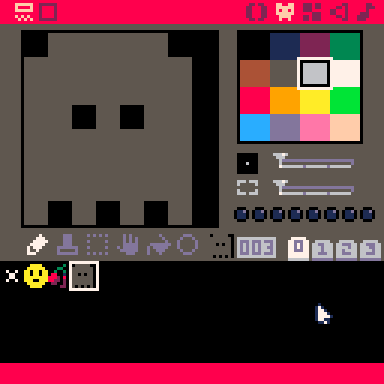
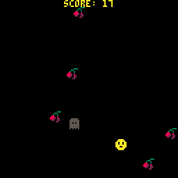
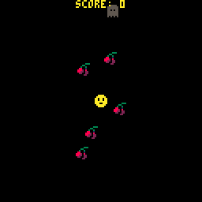

# 9. Enemy at the Gates

> To skip this chapter use the [following link](https://www.pico-8-edu.com/?c=AHB4YQlgA8ECwKzObYwu7c0N5CvNLY0OJUUBBC5Mji5tjK1srmcP4DXccP3NT3H4I9z0GBPDwVtE95xyhw9SH96eZT5rfJjGbxHpiZ7xEP3A_Ze4Y6B6hzY8aMAu9wzYbMA39TNMiIk8RZtsPEUmG369wsTCE1TpwM5IVr1C2jkm8s5CvXDVUFtNGUZCQCk8M0rhz1VK4e9dmuLHjqb4fZhS_KMp7jKIH2KnVjkYCPrqtGJpKcvm5rIsmmvGkjauBnXLsdPE_djAwJ4dg2LN-BgxPwNzRoFAoghKv5FFzWA6N6e8kMWdsrDMgY_K0NKJZQOJwlfY2RiYERFVDock0Zw469jWeROFKDlS9ytwfyQPttKX2BgZaJrFKFFnKMbGumKh3AnfIdwcnQrqLJQ9z3VyDQt_x4KfykACbrDQmFgaG5gIBgQn0yqOqsGlNF3suibtpubu0xlQn9iZCp5BKGhCpEb6qV8p9mRD7eMX95hnQNgeujSu0EDYsImuyF7fd0k7FmyKXU_qjHU3qoWKS6nfeVqSRINMP1S6VD7QfBri1DGJ9UYlC9UGA7XxjqTp2FJ5mwRSWCfLgZNmtoqhRNX8EM7repFiw0Om-L_0NXbqjboS9ws1DbMrd7W2wwltc-jbOPJMy2O1VyRZBJRL9wwkeesjpbZ_2O3b8t6iZ3r9VxOJfVynAjuwp-gr_X6Jt-_HKDqk1-9PK7yKH-gT0J5ZLC2kI1JyOuTSlpX9EpinMj3doJwebgqbikYmJqY3enoKc7uYKXwtNIWzgabwUzFD4d5aTnMju9Ide5t7VcMHYUvJ0sR0KOsRRVM_UP3YWFkZbmYW5p4iynZ0OfgoQI1jKBXMtwzlW9QTK1ExshLJCsdpu5JULvDOjl6lV8L5xZ2BPXtsbBdbpWqoSvojFo_ZdEtcWOg3EfqTMBsRTYuU-3T6IammqSAtNzJQ_EimoPCAp7g0AEUC2ihKm7VJ6ZXBKjBeqBGwYvxrJN3z2UpiuzD0Vbb5GHuZhtiGhKBei0mEr20lxlfYzNrOuEAx-hQQXz-MJiHd1tp4o2mjmRFtTnhAfMQKUsrS3yrj1Q9KkglRLvmAgTZCwSAVAStV8loCAVOrLtnQ_J1cUNDPWNVp2-_RvlbGRyiVUU7IzWq1Q-xGZ1P7VhpGjnFwVwHTM0qMntRVh-IWGYjHZrbTvlZSp7c2yqVp2awD4mhi0AMTsumvWDi0cmvGEVPLEA6wdWHbwBaBbfeSYqQY7GuFrXpyr632BB5EVyTnzNJWMpMyPQ==&g=wG6AwDjA1Bw-wk6CwATg1Dw-wcHQHQaAaAaQDQDQ1Dw-wdXgaAaAaAYQBQVAFAVw-wdXg6EoCAIQ1Dw-wcHQHQqQqYSASA1Dw-wj6CQSQSA1Dw-wk6AwCSQFAFAFAF)

## There is no challenge!

So lets add some challenge by adding some enemies that respawn outside the view and slowly going towards the player.

Draw a sprite for the enemy... how about a ghost?



As with particles we need a table for all the enemies, and do the same draw and update tango as with everything else:

```lua
FUNCTION _INIT()
 -- SNIP SNIP
 ENEMIES={}
END

FUNCTION _DRAW()
 -- SNIP SNIP
 FOR E IN ALL(ENEMIES) DO
  E:DRAW()
 END
END

FUNCTION _UPDATE()
 -- SNIP SNIP
 FOR E IN ALL(ENEMIES) DO
  E:UPDATE()
 END
END
```

Drawing the ghost is as simple as drawing the sprite:

```lua
FUNCTION DRAW_ENEMY(E)
 SPR(3,E.X,E.Y)
END
```

We want the ghost to chase the player, so first figure out what the angle is between both and then change the position of the ghost towards the player. PICO-8 API has `ATAN2` function that lets you get the angle with a given x,y vector.

```lua
FUNCTION UPDATE_ENEMY(E)
 LOCAL DX=PLAYER.X-E.X
 LOCAL DY=PLAYER.Y-E.Y
 LOCAL A=ATAN2(DX,DY)-0.25
 E.X+=SIN(A)
 E.Y-=COS(A) -- REMEMBER THE SCREEN IS FLIPPED
END
```

Lets write a function to add a ghost and to add one initial ghost in `_INIT`. Spawn the ghost 68 pixels away from the center.

```lua
FUNCTION _INIT()
 -- SNIP SNIP
 ADD_ENEMY()
END

FUNCTION ADD_ENEMY()
 LOCAL A=RND(1)
 ADD(ENEMIES, {
  X=64-(SIN(A)*68),
  Y=64-(COS(A)*68),
  DRAW=DRAW_ENEMY,
  UPDATE=UPDATE_ENEMY
 })
END
```

The enemy should move around like this when running the program:



## MORE!

Okay, lets spawn more ghosts in regular intervals to do this, we need to keep track of when to spawn the next ghost. How about every 2 seconds? We can get the game time with the `T` function. So lets have a state variable that tells when next enemy will spawn. We can initiate this in `ADD_ENEMY` since it is already called in the `_INIT` and will set a new time for next enemy to spawn:

```lua
FUNCTION ADD_ENEMY()
 NEXT_ENEMY=T()+2 -- T returns game time in seconds
 -- SNIP SNIP
END
```

And lets do the spawning in the `_UPDATE` function when the time has passed:

```lua
FUNCTION _UPDATE()
 -- SNIP SNIP
 IF T() > NEXT_ENEMY THEN
  ADD_ENEMY()
 END
END
```

The game should now spawn ghosts every 2nd second.



## Points to review

- `ATAN(X,Y)` gives you the angle from 0,0 to X,Y (aka. a vector).
- The `T` function gives you the current game time in seconds

## [Next Chapter - It's Game Over, Man!](./10-game-over.md)

## [Back to the README](./README.md)
