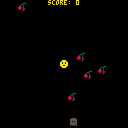

# PICO-8 Workshop

This repository is dedicated for a PICO-8 workshop for Knowabunga 2022.

## 0. Prerequisites

- A computer that can run a web browser or (optionally) PICO-8
- Good to know: any programming languages, PICO-8 runs LUA
- Optional: A copy of PICO-8 which can be bought at the official site or on itch.io.

The workshop will assume that you're using the [education edition of PICO-8](https://www.pico-8-edu.com/) and the reason for this is to get you started. If you'd like to buy PICO-8 you can do it from the [official website](https://www.lexaloffle.com/pico-8.php) or from the [pico 8 itch.io page](https://lexaloffle.itch.io/pico-8).

## The Workshop Chapters

This online material will give you a guide on how to write your very own game. It will take around 2 hours to go through (hopefully without any hitch) and look like this:

1. [Getting started](./1-getting-started.md) - Some PICO-8 basics you need to know
2. [Your First Loop](./2-your-first-loop.md) - Writing your first interactive program, draw a sprite and control it
3. [Smooth Runnings](./3-smooth-runnings.md) - Improve the animation, add variables for velocity
4. [They call him Bobby Tables](./4-bobby-tables.md) - Create game objects using LUA tables
5. [Pick Me Up](./5-pick-me-up.md) - For loops, LUA tables as arrays/lists
6. [Crash Test Dummies](./6-crash-test-dummies.md) - Removing elements from array, collision detection using distance formula
7. [Keeping the Score](./7-keeping-the-score.md) - Print score, respawn objects and center the text
8. [Particle Galore](./8-particle-galore) - Super simple particle effects
9. [Enemy at the Gates](./9-enemy-at-the-gates) - Add simple enemies
10. [It's Game Over, Man](./10-game-over) - Add a game over screen by changing update and draw functions
11. [What to do next](./11-what-to-do-next)

## Links

- [Official PICO-8 homepage](https://www.lexaloffle.com/pico-8.php)
- [PICO8 Wiki](https://pico-8.fandom.com/wiki/Pico-8_Wikia) - [API reference](https://pico-8.fandom.com/wiki/APIReference)
- [PICO-8 User Manual](https://www.lexaloffle.com/dl/docs/pico-8_manual.html)
- [LUA primer](https://github.com/THE-ORONCO/pico-8/wiki/Lua-Syntax-Primer)
- [PICO-8 Discord server](https://discord.gg/MhQAzTw)
- [PICO-8 Cheat Sheets](https://www.lexaloffle.com/bbs/?tid=28207)
- How to publish your game to itch.io
  - [Publishing PICO-8 to itch.io](https://itch.io/jam/toy-box-jam-2019/topic/645069/publishing-pico-8-to-itchio)
  - [How to nicely upload your game](https://www.lexaloffle.com/bbs/?tid=40036) - provides some more instructions on changing the HTML etc.

## Inspirations

- [PICO-8 BBS](https://www.lexaloffle.com/bbs/?cat=7) (this is also available with PICO-8's `SPLORE` command)
- [Awesome PICO-8](https://github.com/pico-8/awesome-PICO-8)
- [itch.io PICO-8 tag](https://itch.io/games/tag-pico-8)

## Are there other virtual consoles?

Yes, there are! Here is some information and lists below:

- [Fantasy Console Wars: A guide to The Biggest Players in Retrogaming's Newest Trend](https://medium.com/@G05P3L/fantasy-console-wars-a-guide-to-the-biggest-players-in-retrogamings-newest-trend-56bbe948474d)
  - [Tic-80](https://tic80.com)
  - [Pixelvision 8](https://pixelvision8.itch.io/p8)
  - [LIKO-12](https://github.com/LIKO-12/LIKO-12)
- [Fantasy Consoles/Computers](https://paladin-t.github.io/fantasy)
- [Fantasy Console Discord](https://discord.gg/jcT9CXDgHB)
